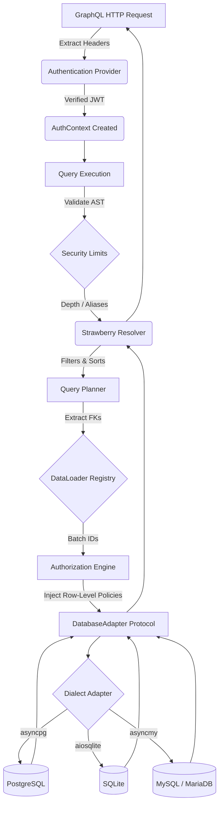

# Architecture: db-graphql-gateway

The `db-graphql-gateway` is designed with a strict separation of concerns, decoupling the database
inspection and query compilation from the GraphQL presentation layer and authentication logic.

---

## 1. Core Execution Pipeline

The life cycle of a GraphQL query from the HTTP request down to the database engine follows this
strict pipeline:



---

## 2. Package Boundaries

The codebase is strictly separated into four functional areas:

<div class="grid cards" markdown>

-   :material-database: **Database Abstraction**
    ---
    Located in `database/`. Handles adapters (`PostgresAdapter`, `SQLiteAdapter`,
    `MySQLAdapter`), schema inspection, normalised models, and dialect-parameterised
    query compilers. **No dialect-specific logic leaks above this layer.**

-   :material-transit-connection-variant: **Schema Intermediate Representation**
    ---
    Located in `schema/ir/`. The source of truth mapping database structure to
    GraphQL schemas. It is database-agnostic and GraphQL-agnostic.

-   :material-graphql: **GraphQL Generation**
    ---
    Located in `graphql/`. Converts the IR into a Strawberry GraphQL schema (types,
    queries, mutations) and handles execution, filtering, sorting, pagination.
    Talks only to the IR and the `DatabaseAdapter` protocol — never to a dialect.

-   :material-security: **Security & Auth**
    ---
    Located in `auth/` and `security/`. Validates callers (e.g., JWT), evaluates
    contextual policies to generate SQL predicate trees (`FilterCondition` /
    `FilterGroup`), and enforces query complexity budgets and AST limits. Produces
    dialect-neutral predicate objects; placeholder style is owned by the compiler.

</div>

---

## 3. Multi-Dialect Adapter Architecture

### 3.1 `DatabaseAdapter` Protocol

Every adapter implements the same protocol from `database/adapters/interfaces.py`:

```python
class DatabaseAdapter(Protocol):
    # ── Dialect capability flags ──────────────────────────────────────────
    supports_returning: bool          # RETURNING clause supported after DML
    supports_upsert_on_conflict: bool # ON CONFLICT DO UPDATE / ON DUPLICATE KEY
    placeholder_style: PlaceholderStyle  # "numbered" | "qmark" | "named"
    identifier_quote_char: str        # '"' | '`' | '['

    async def connect(self) -> None: ...
    async def close(self) -> None: ...
    async def execute(self, query: CompiledQuery) -> QueryResult: ...
    async def execute_many(self, queries: list[CompiledQuery]) -> list[QueryResult]: ...
    def inspector(self) -> SchemaInspector: ...
    def compiler(self) -> QueryCompiler: ...
    def type_mapper(self) -> TypeMapper: ...
```

### 3.2 `BaseQueryCompiler`

All SELECT / DML SQL generation lives in `database/adapters/base_compiler.py`.
Dialect subclasses only set three class-level attributes:

| Subclass | `placeholder_style` | `identifier_quote_char` | `supports_returning` |
|---|---|---|---|
| `PostgresQueryCompiler` | `"numbered"` (`$1, $2, …`) | `"` | `True` |
| `SQLiteQueryCompiler` | `"qmark"` (`?, ?, …`) | `"` | runtime-detected (≥ 3.35.0) |
| `MySQLQueryCompiler` | `"qmark"` (`?, ?, …`) | `` ` `` | `False` |

When `supports_returning = False`, `compile_mutation()` sets
`CompiledQuery.fetch_after_write = True` and the adapter's `execute()` issues a
follow-up `SELECT` using `cursor.lastrowid` (INSERT) or the known PK value
(UPDATE / DELETE). This pattern is called **SELECT-after-write**.

### 3.3 Introspection

Each adapter ships its own `SchemaInspector` that reads dialect-specific metadata:

| Adapter | Introspection source |
|---|---|
| `PostgresSchemaInspector` | `pg_class`, `pg_attribute`, `pg_constraint`, `pg_enum` |
| `SQLiteSchemaInspector` | `PRAGMA table_info`, `PRAGMA foreign_key_list`, `sqlite_master` |
| `MySQLSchemaInspector` | `information_schema.columns`, `information_schema.key_column_usage` |

All three produce the **same** `DatabaseSchema → Table → Column` data model.
`IRBuilder.build()` is called identically regardless of which inspector ran.

---

## 4. Schema Intermediate Representation (IR)

The Gateway decouples the database schema from the GraphQL schema using the IR
(`GraphQLTypeIR`, `GraphQLFieldIR`).

1. **Introspection (`inspector.py`)**: Reads dialect-specific system catalogs to
   construct a `DatabaseSchema` with normalised `Column.type` strings.
2. **Type mapping (`TypeMapper`)**: Each adapter's `TypeMapper` converts
   normalised column types to abstract GraphQL scalar names (`"Int"`, `"Float"`,
   `"String"`, `"DateTime"`, `"Boolean"`, `"JSON"`). No raw DB type strings leak
   past the `TypeMapper`.
3. **IR Build (`IRBuilder`)**: Converts the low-level schema into GraphQL-centric
   constructs. During this phase, `GatewayConfig` overrides are applied.
   **Sensitive fields** (e.g., `password`, `token`) are automatically redacted here
   based on name-pattern matching — dialect-agnostically.

---

## 5. GraphQL Schema Generation (Build-Time)

The `GraphQLSchemaBuilder` transforms the IR into a Strawberry GraphQL schema
dynamically using Python's `type` function. This happens exactly **once at startup**.

### Dynamic Annotations & Mypy
Because Strawberry relies heavily on Python's type hints (`__annotations__`) to
build the static GraphQL schema, the Builder must dynamically construct these
dictionaries for every resolver it generates.

```python title="Injecting annotations dynamically to satisfy Strawberry"
update_fn.__annotations__ = {
    "info": Info,
    "id": pk_type,
    "input": update_input_type,
    "expected_version": Optional[int],
    "return": Optional[sb_type],
}
```

!!! note "Strict Typing"
    This architecture cleanly separates the dynamic runtime from static analysis,
    allowing the core engine to pass strict `mypy` checks.

---

## 6. Execution & DataLoading (Per-Request)

When a resolver executes, it does not use an ORM. It builds a `QueryPlan` that is
compiled directly into SQL via the adapter's `QueryCompiler`.

### N+1 Query Elimination
Nested relationship fields use Strawberry DataLoaders that batch foreign keys at
execution time. The query compiler merges these batched IDs (e.g.,
`WHERE author_id IN ($1, $2)` or `WHERE author_id IN (?, ?)`) ensuring constant
$O(1)$ database execution regardless of the depth of the graph.

The `DataLoaderRegistry` receives a `schema_map` dict (`type_name → schema_name`)
from `GraphQLSchemaBuilder`, so relationship batch queries use the correct schema
name for each adapter (e.g., `"public"` for Postgres, `"main"` for SQLite).

### Optimistic Concurrency & Soft Deletes
The `IRBuilder` automatically detects `version` and `deleted_at` columns.

- **Soft Deletes**: List queries automatically append `deleted_at IS NULL` filters,
  and `delete_` mutations are converted into `update_` operations that set the
  deletion timestamp.
- **Optimistic Locking**: Mutations include an `expected_version` argument. If
  provided, the update query asserts `version = <expected>` and increments it,
  failing if another transaction modified the row concurrently.

Both features are detected from **IR field names** (`f.name == "deleted_at"`,
`f.name == "version"`) — never from raw schema or adapter code.

---

## 7. Authorization Predicates

!!! danger "Zero Memory Filtering"
    The Gateway **never** filters sensitive data in Python memory. All authorization
    policies are pushed down to the database engine as SQL `WHERE` predicates,
    regardless of which adapter is in use.

The `AuthorizationEngine` evaluates contextual policies and generates
`FilterCondition` / `FilterGroup` predicate trees. When the `QueryCompiler` builds
the final SQL string, it merges the basic user `WHERE` filters with the
authorization predicates.

The placeholder style (e.g., `$1` for Postgres, `?` for SQLite/MySQL) is owned
**exclusively by the compiler** — the auth engine produces dialect-neutral predicate
objects and has no knowledge of the underlying database engine.

For example, a policy defining `owner_id = $user_id` on the `tasks` table will
statically inject:

- `AND "owner_id" = $1` in Postgres SQL
- `AND "owner_id" = ?` in SQLite / MySQL SQL

In all cases, unauthorized rows are **never loaded into memory**.
