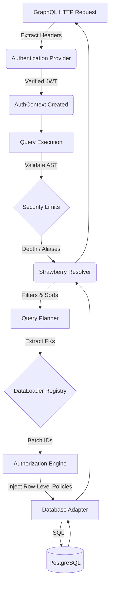

# Architecture: db-graphql-gateway

The `db-graphql-gateway` is designed with a strict separation of concerns, decoupling the database inspection and query compilation from the GraphQL presentation layer and authentication logic.

## 1. Core Execution Pipeline

The life cycle of a GraphQL query from the HTTP request down to the database engine follows this strict pipeline:



## 2. Package Boundaries

- **Database Abstraction (`database/`)**: Adapters (PostgreSQL `asyncpg` via `PostgresAdapter`), schema inspection, normalized models, and query compilers.
- **Schema Intermediate Representation (`schema/ir/`)**: The source of truth mapping database structure to GraphQL schemas. It is database-agnostic and GraphQL-agnostic. 
- **GraphQL Generation (`graphql/`)**: Converts the IR into a Strawberry GraphQL schema (types, queries, mutations) and handles execution, filtering, sorting, pagination.
- **Security & Auth (`auth/`, `security/`)**: Validates callers (e.g., JWT), evaluates contextual policies to generate SQL predicates, and enforces query complexity budgets and AST limits.

## 3. Schema Intermediate Representation (IR)

The Gateway decouples the database schema from the GraphQL schema using the IR (`GraphQLTypeIR`, `GraphQLFieldIR`).

1. **Introspection (`inspector.py`)**: Queries PostgreSQL system catalogs (`pg_class`, `pg_attribute`, `pg_constraint`, `pg_enum`) to construct a `DatabaseSchema`.
2. **IR Build (`IRBuilder`)**: Converts the low-level schema into GraphQL-centric constructs. During this phase, `GatewayConfig` overrides are applied. **Sensitive fields** (e.g., `password`, `token`) are automatically redacted here based on pattern matching.

## 4. GraphQL Schema Generation (Build-Time)

The `GraphQLSchemaBuilder` transforms the IR into a Strawberry GraphQL schema dynamically using Python's `type` function.

This happens exactly **once at startup**.

### Dynamic Annotations & Mypy
Because Strawberry relies heavily on Python's type hints (`__annotations__`) to build the static GraphQL schema, the Builder must dynamically construct these dictionaries for every resolver it generates. 

```python
# Example: Injecting annotations dynamically to satisfy Strawberry
update_fn.__annotations__ = {
    "info": Info,
    "id": pk_type,
    "input": update_input_type,
    "expected_version": Optional[int],
    "return": Optional[sb_type],
}
```
*Note: This architecture cleanly separates the dynamic runtime from static analysis, allowing the core engine to pass strict `mypy` checks.*

## 5. Execution & DataLoading (Per-Request)

When a resolver executes, it does not use an ORM. It builds a `QueryPlan` that is compiled directly into SQL.

### N+1 Query Elimination
Nested relationship fields use Strawberry DataLoaders that batch foreign keys at execution time. The query compiler merges these batched IDs (e.g., `WHERE author_id IN ($1, $2)`) ensuring constant $O(1)$ database execution regardless of the depth of the graph.

### Optimistic Concurrency & Soft Deletes
The `IRBuilder` automatically detects `version` and `deleted_at` columns. 
- **Soft Deletes**: List queries automatically append `deleted_at IS NULL` filters, and `delete_` mutations are converted into `update_` operations that set the deletion timestamp.
- **Optimistic Locking**: Mutations include an `expected_version` argument. If provided, the update query asserts `version = $expected_version` and increments it, failing if another transaction modified the row concurrently.

## 6. Authorization Predicates

> [!IMPORTANT]
> The Gateway **never** filters sensitive data in Python memory.

The `AuthorizationEngine` evaluates contextual policies and generates SQL predicate ASTs. When the `QueryCompiler` builds the final SQL string, it merges the basic `WHERE` filters with the authorization predicates.

For example, a policy defining `$user_id = owner_id` on the `tasks` table will statically inject `AND owner_id = $1` into the generated SQL query for *both* lists and nested DataLoaders. Unauthorized rows are never loaded into memory.
